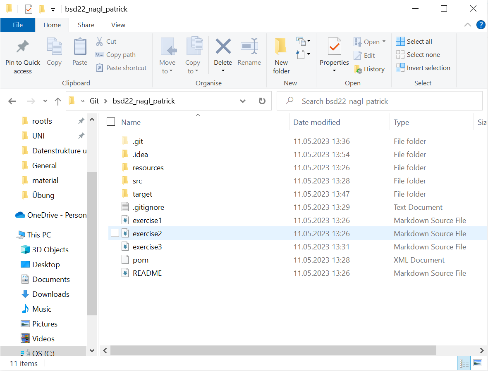
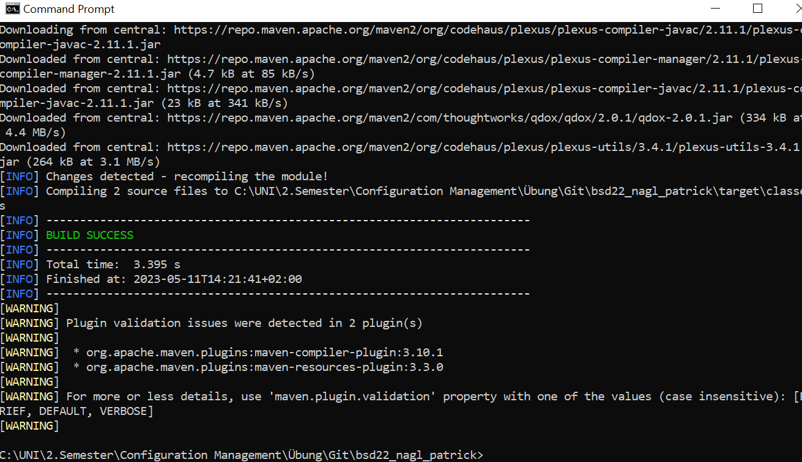

# Exercise 3

## First Assignment

This is a screenshot of my directory after first running of the program.
After this, maven made a new directory: `target`

## Second Assignment

After configuration of maven I made another screenshot:

